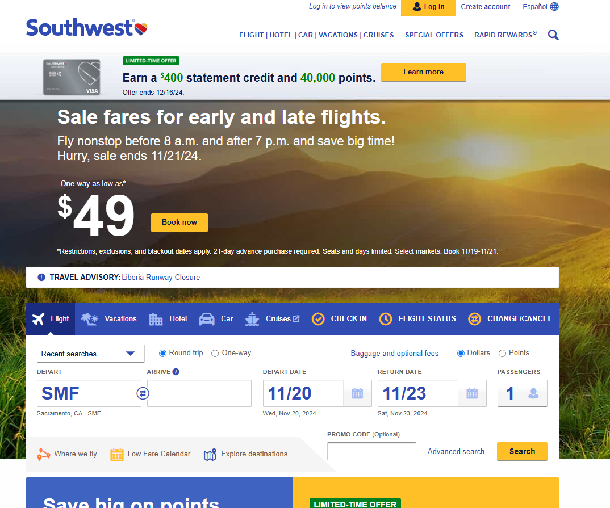
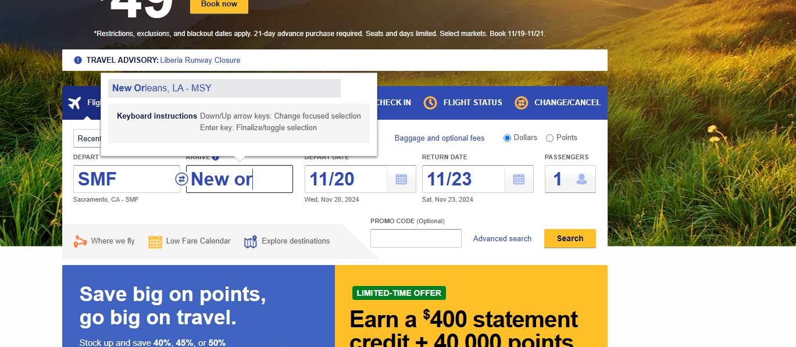
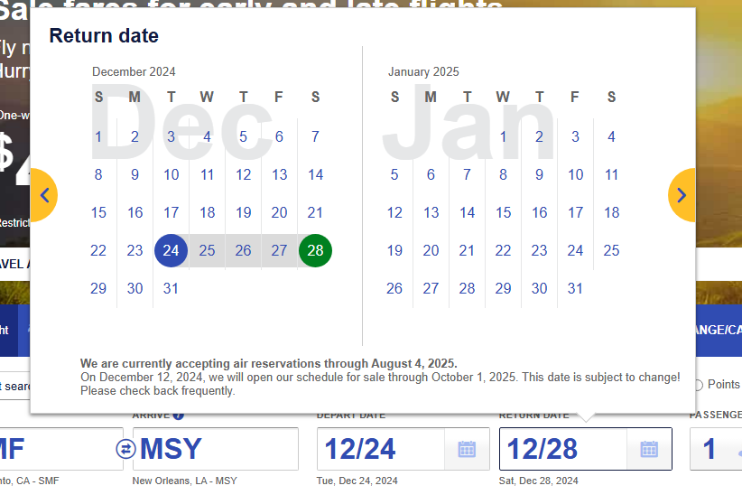
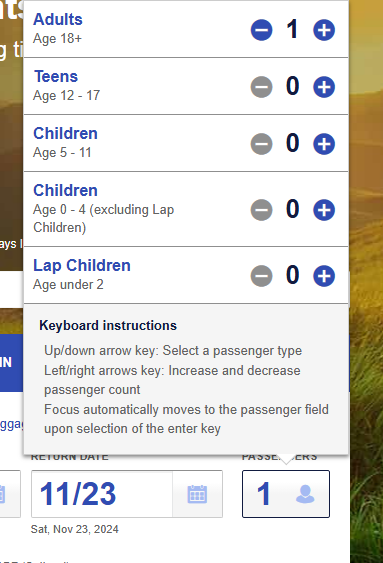
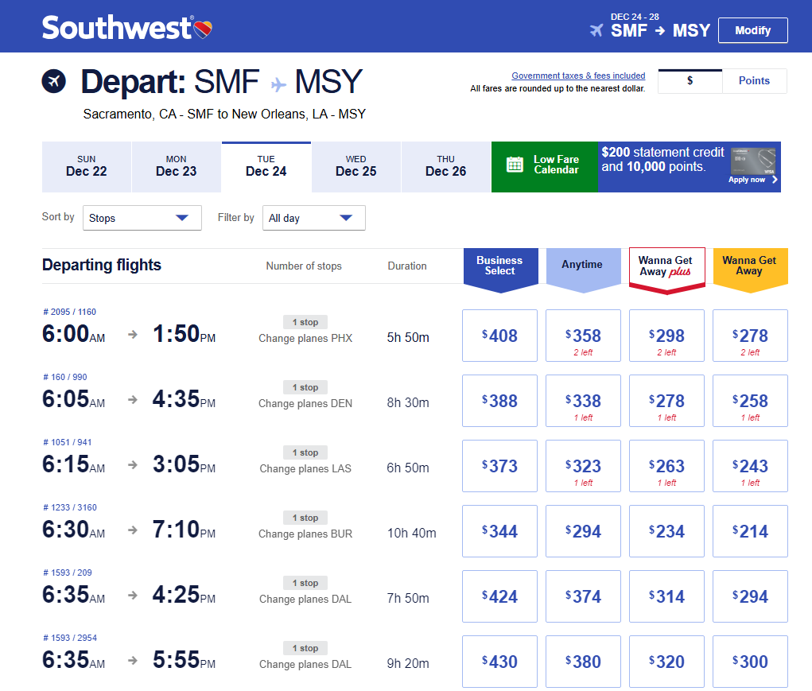
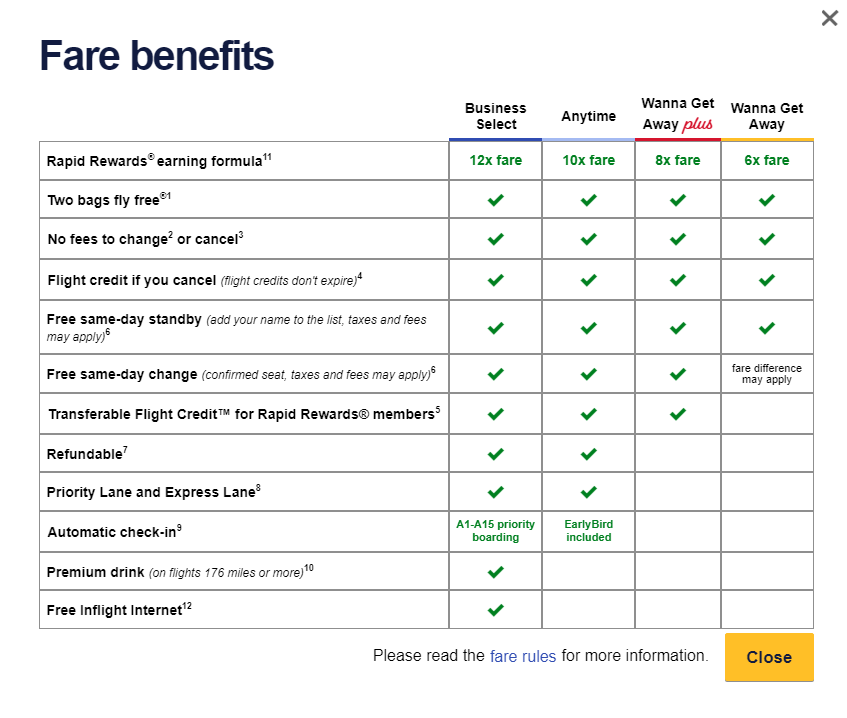

Earlier this month, my sister invited me to tag along with her and her husband on a trip to New Orleans on Christmas. I have never been out of state ever since I came to the US, so this is a very exciting offer for me. My sister suggested using SouthWest airline as the price is cheaper compared to other airlines, so I spent a morning taking a look at their website.
I simply looked up “SouthWest airlines”,  clicked on the first search result and I got directed to the SouthWest main website. I really appreciated how simple and straightforward the website looked. 

    

I did not pay attention to the offers/sales that were being promoted on the home page as I do not travel with airplanes that often, so long term offers/sales do not benefit me as much. What really got my attention was the option to pick the flight. I appreciate how they know I am in Chico (maybe because of my cookie setup) so they just auto-input the closest (or viable) airport, which is in Sacramento. As I was entering the word “New Orleans” into the “ARRIVE” box, the box showed me a list of match destinations. I found this quite helpful, as I did not even know that New Orleans is in Louisiana.

    

I moved to picking a departing day and returning day. The process is extremely simple, the user can either enter their desired day by hand, or select the calendar icon within the box, which will show a mini calendar of the current month and upcoming months. The date of my travel will be on Christmas Eve till the 28th. So I just clicked on these 2 days in the calendar.

    

Then I clicked on the “PASSENGERS” and set 1 for Adults. After got my desired selection, I just hit “Search”.

    

The result of the search is a list of available flights that fit my desire. The list is very transparent, it has multiple columns, each matches a different information: departure time, arrival time, number of stops, duration, and price table. What got my attention was having multiple prices on a single flight.

    

I noticed that the categories (Business Select, Anytime, Wanna Get Away plus, and Wanna Get Away) are interactable. As I clicked on them, a table showed up and explained the said categories. It was simply explaining what benefits user would get for each different options.

    

As a poor college student, I chose the cheapest one. Then the website proceeded to direct me to pick another flight to get back to Sacramento airport from New Orleans. After confirming flights and days, all that was left for me to do is to enter my personal information and credit/debit card numbers. The checkout process is as similar as any other website that provides online purchase.

In conclusion, I find the SouthWest airline website is an effective and user-friendly website that ensure new user's satisfactory. Its intuitive design and streamlined navigation allow users to book flights, manage reservations, and explore travel options with ease. Although I did have a few doubts while using, the website ensured that there would be answers to my doubts.